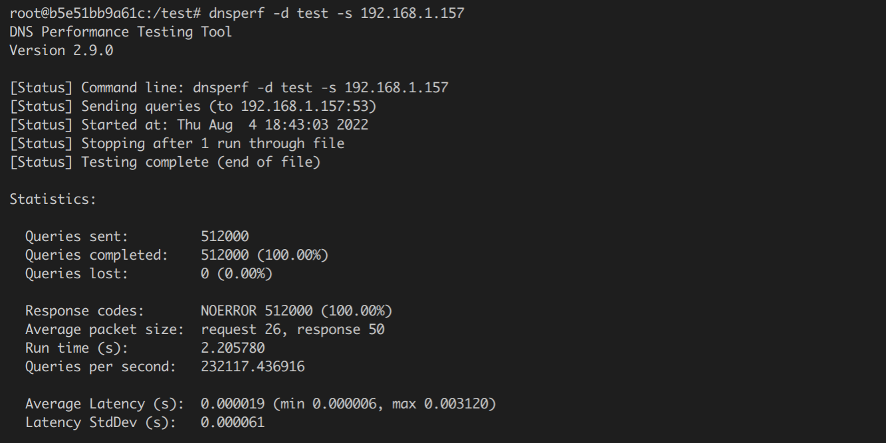
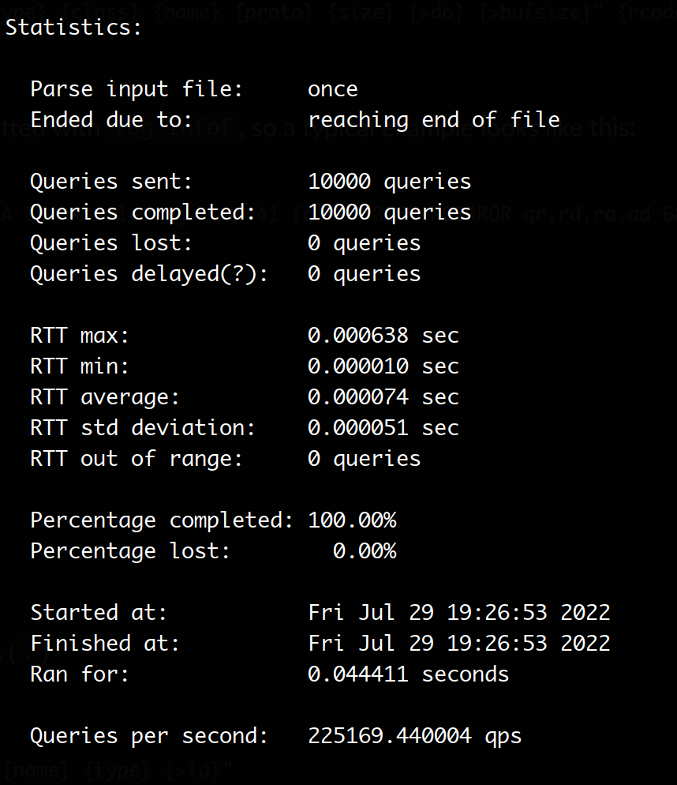
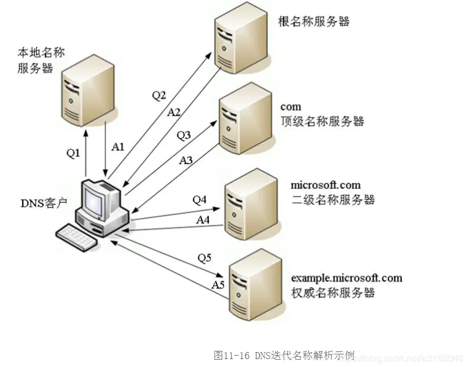

# README

# 基于eBPF的DNS Cache实现

# 背景

本项目是课题 [基于eBPF的DNS Cache实现](https://www.gitlink.org.cn/glcc/subjects/detail/257) 的具体实现


# 功能

1. 缓存 DNS 解析记录及统计解析失败率
2. 在达到失败阈值时，例如有 20% 的 DNS Query 请求都失败了，可以尝试通过已缓存的解析记录，构造 DNS Reply 来解决解析失败的场景
3. 适合容器场景及 IPv4 网络

# **与传统工具的不同之处**

1. 零配置，无需设置 iptables 规则或者更改 docker 容器内 DNS 服务器地址，只需一行 docker 命令即可开始使用
2. 可视化

# 运行

1. 通过 Docker 运行

```bash
# 推荐方式
docker run --privileged=true --net=host ghcr.io/7rah/ebpf-dns-cache:latest
# 在本地自行编译 Docker 容器并运行
git clone https://github.com/linuxkerneltravel/lmp.git
cd lmp/eBPF_Supermarket/ebpf_dns_cache
docker build . -t ebpf-dns-cache
# config.toml 的设置可以参考当前目录下 config.toml
docker run --privileged=true --net=host -v /path/to/config.toml:/config.toml ebpf-dns-cache:latest 
```

1. 在本地自行编译

```bash
# 使用 Ubuntu 系统
apt-get -y install clang-14 libelf-dev zlib1g-dev make libbpf-dev git pkg-configcurl --proto '=https' --tlsv1.2 -sSf https://sh.rustup.rs | sh
git clone https://github.com/linuxkerneltravel/lmp.git
cd lmp/eBPF_Supermarket/ebpf_dns_cache
cargo build --release
```

# 可视化与 API

```bash
# 以可视化的方式运行本项目
docker run --privileged=true --net=host ghcr.io/7rah/ebpf-dns-cache:latest

# prometheus.yml 的内容可以参考本项目下 visualization 目录下的内容
docker run --net host -v prometheus.yml:/etc/prometheus/prometheus.yml prom/prometheus

# 注意，grafana 需要手动设置数据源（prometheus）和导入图表，visualization 目录下有已经保存好的
# 图表设置（DNS Cache-1665678419233.json），直接导入即可使用
docker run -d --net host --name grafana grafana/grafana-enterprise:8.2.0
```

目前本项目提供了 `prometheus`  所需的 `/metrics` API 和本项目自定义的 `/info` API

`/info` API 主要用来呈现 `cache` `matching` `matched` `unmatched` 这四章表的内容


# 性能对比

### DNS Cache



### CoreDNS



# 配置

```bash
[global]
interface = "docker0"   #监听的接口
log = "debug" # 输出日志级别,有 error,warn,info,debug,trace
report_interval = "5s" # 输出 matching matched unmatched cache 四张表信息（日志级别设为 trace）
                       # 还有总体的统计信息
worker = 1 # 工作进程数量
loss = 0.2 # 20% 的DNS query 失败时构造响应并注入
api_listen_at = "127.0.0.1:4000" # api 端口监听地址

[matching]
capacity = 16384 # 最大容量
timeout = "5s" # 超时时间，超过这个时间的话会认为该 DNS query 超时

[matched]
capacity = 16384
ttl = "10m"

[unmatched]
capacity = 16384
ttl = "10m"

[cache]
capacity = 16384
ttl = "10m" # 解析记录的缓存时间
```

# 开发

使用 VS Code 提供的 devcontainer 功能，无需繁琐的配置，即可进行开发

- 首先, 需要在 VS Code 中安装对应的插件 [Remote Development extension pack](https://link.zhihu.com/?target=https%3A//marketplace.visualstudio.com/items%3FitemName%3Dms-vscode-remote.vscode-remote-extensionpack)
- 安装完成之后，左下角会有一个 >< 的图标
- 打开项目文件夹 lmp/eBPF_Supermarket/ebpf_dns_cache，点击 >< 的图标，选择 Reopen in Container，等待片刻即可开始开发


如果你想重新生成 vmlinux.h，只需运行

```bash
bpftool btf dump file /sys/kernel/btf/vmlinux format c
```

# 项目实现细节

## 使用 eBPF 程序抓取 DNS 数据包

目前项目使用的是 socket_filter ，attach 到原始套接字上对数据包进行过滤，筛选出 UDP 协议的 DNS 数据包。选择 socket_filter 的原因如下

- XDP 目前只能抓取 RX 方向的数据包，而不能抓取 TX 方向的数据包
- TC 的功能十分强大，但本项目暂时不需要进行非常复杂的数据包处理，且 TC 程序在 libbpf-rs 中的支持还不是很完善，无法与现有的 tokio 异步生态结合

鉴别一个数据包是否为 DNS packet，[Identifying DNS packets](https://stackoverflow.com/questions/7565300/identifying-dns-packets) 这篇 stackoverflow 文章给出了思路，我们可以先通过识别端口号是否为 53，再辨别 QDCOUNT 的值是否为1（在实践中绝大多数的 DNS packet QDCOUNT 的值都为 1）。具体到编写 eBPF 程序，我们只需从 udp payload 中提取 QDCOUNT（在第五，第六字节），并判断其值是否为 0x0001，通过 raw socket 发送到用户态程序

```bash
# dns packet header
1  1  1  1  1  1
  0  1  2  3  4  5  6  7  8  9  0  1  2  3  4  5
+--+--+--+--+--+--+--+--+--+--+--+--+--+--+--+--+
|                      ID                       |
+--+--+--+--+--+--+--+--+--+--+--+--+--+--+--+--+
|QR|   Opcode  |AA|TC|RD|RA|   Z    |   RCODE   |
+--+--+--+--+--+--+--+--+--+--+--+--+--+--+--+--+
|                    QDCOUNT                    |
+--+--+--+--+--+--+--+--+--+--+--+--+--+--+--+--+
|                    ANCOUNT                    |
+--+--+--+--+--+--+--+--+--+--+--+--+--+--+--+--+
|                    NSCOUNT                    |
+--+--+--+--+--+--+--+--+--+--+--+--+--+--+--+--+
|                    ARCOUNT                    |
+--+--+--+--+--+--+--+--+--+--+--+--+--+--+--+--+
```


## 使用 docker 运行 eBPF 程序

### 开发环境

```bash
ARG VARIANT="ubuntu-22.04"
FROM mcr.microsoft.com/vscode/devcontainers/base:0-${VARIANT}

# [Optional] Uncomment this section to install additional OS packages.
RUN apt-get update && export DEBIAN_FRONTEND=noninteractive \
    && apt-get -y install --no-install-recommends clang-14 libelf-dev zlib1g-dev make libbpf-dev git pkg-config \
    && ln -s /usr/bin/clang-14 /bin/cc \
    && ln -s /usr/bin/clang-14 /bin/clang

USER vscode
RUN curl https://sh.rustup.rs -sSf > /tmp/rustup.sh \
    && sh /tmp/rustup.sh -y \
          --default-toolchain stable
```

你可以参考本项目开发环境的 [Dockerfile](https://github.com/linuxkerneltravel/lmp/blob/develop/eBPF_Supermarket/ebpf_dns_cache/.devcontainer/Dockerfile)，添加你的开发环境需要的软件包打造你自己的容器化开发环境

### 运行环境

将编译出来的 eBPF 程序像正常的应用程序打包，运行时加上 `--privileged=true` 选项以便 能正常地将 eBPF 程序 load 进内核

## 构造 DNS 响应时遇到的一些坑

DNS 响应中的 `Recursion desired` 和 `Recursion available` 这两个值应该被设置为 1，否则上层应用程序无法正常识别到注入的 DNS 响应。这是因为绝大多数情况下，客户端会将 Recursion desired 值设置为 1，也就是要求服务器支持递归查询，如果 Recursion available 设置为0（表明我们服务器默认不支持递归查询），那么客户端默认就会 reject 掉我们注入的 DNS 响应。




## **eBPF 开发库的选择**

Rust 生态下，比较流行的，用于 eBPF 程序开发的有 `redbpf`，`aya`，`libbpf-rs`

| 库 | redbpf | aya | libbpf-rs |
| --- | --- | --- | --- |
| 活跃程度 | 低 | 高 | 高 |
| 使用何种语言开发eBPF 内核态程序 | Rust | Rust | C |
| 开发难度 | 低（redbpf 的封装完善，有很多 helper 函数） | 较高（aya 使用 bindgen 来支持用 Rust 操纵 C 的数据结构，操作起来的人体工程学不是很优秀） | 较低（目前在用户态的封装不是很完善，使用 C 来开发 eBPF 体验更好） |
| 编译环境部署难度 | 最高，其直接依赖 libbpf C库，需要配置好 C 的编译环境，依赖 Linux headers | 最低。aya 直接依赖 Rust标准工具链，使用 xtask 编译，aya 自行实现了 linker，无需依赖 Linux headers 和 clang | 较低，需要安装 clang，无需依赖 Linux headers |

初版的 demo 使用 redbpf 实现，目前的实现基于 libbpf-rs，其潜力更大，受到 libbpf 官方的支持，未来的生态会更好一些，且用 C 语言开发 eBPF 内核态程序相对而言更简单（当你需要操纵 C 中的数据结构的时候）

## **数据收集与处理**

目前设计了四张表用于存储数据，可使用 API 导出（参见可视化与 API 章节内容）

|  | MATCHING | MATCHED | UNMATCHED | CACHE |
| --- | --- | --- | --- | --- |
| 内容 | 正在匹配中的数据包的一些元数据（mac 地址，ip 地址，端口号，域名） | 已匹配好的数据包的一些元数据（mac 地址，ip 地址，端口号，域名，DNS Reply） | 未匹配到的数据包 | 当前缓存好的 DNS 条目（域名，ip） |

# eBPF 的 CO-RE 特性

在生产实践过程中，人们发现 eBPF 程序的开发和运行有一些痛点。

- 原始的 eBPF 程序，与内核版本密切相关，需要人为去找对应 target host 上的内核头文件，然后和 eBPF 代码一起编译，不利于部署。
- BCC 模式，将 C 代码包含在 Python 代码内，需要 target host 上有对应的内核头文件，在运行时调用 LLVM 编译。可以看出，我们得需要一套臃肿的工具链才能让我们的 eBPF 程序正常运行，并且启动性能会比较低。可能遇到的一种情况是，生产环境下遇到某些问题，需要挂载 eBPF 程序进行性能检测，等代码编译完，挂载上去的时候，问题已经消失了。

无论使用上述的那种方式，我们都会遇到对内核头文件的依赖问题，而且编译出来的 eBPF ELF 文件，和内核版本绑定，无法做到像普通应用程序一样一次编译到处运行。

所以，到底是什么，导致了 eBPF 程序面临不可移植，做到一次编译，到处运行呢？

- eBPF 程序无法得知其需要访问的结构体的的内存布局，内存布局方面的信息需要在编译时从特定内核头文件获得。
- 此外，内核类型和数据结构处于不断变化之中。不同内核版本的 struct 字段将在 struct 中重新排列，甚至移动到新的内部 struct 中。字段可以重命名或删除，它们的类型也可以改变，或者变成一些兼容字段，或者变成完全不同的字段。结构和其他类型可以重命名，或者可以通过条件编译进行配置，或者被移除。

eBPF 的 CO-RE（Compile Once，Run Everywhere） 特性就是想要解决 eBPF 程序不可移植的问题。CO-RE 特性需要如下组件的配合。

- 内核暴露出 vmlinux.h
- Clang 编译器可将 eBPF 对内核数据结构的访问记录成相应的重定位信息保存在 ELF 文件的 section 中
- BPF loader (libbpf) 将来自内核和 BPF 程序的 BTF 绑定在一起，以便将已编译的 BPF 代码调整到 target host 上的特定内核

通过 libbpf + BTF + CO-RE，我们可以编写更通用的 eBPF 程序，甚至像对待普通的用户态应用程序一样，将其封装在 docker 容器中（需要 docker 暴露一定的权限，最简单的方式是 –privileged=true），在支持 CO-RE 特性的 Linux 内核上，我们只需要一行命令即可运行。这将大大降低部署和使用 eBPF 技术的难度，同时也能带来更加优秀的开发体验。

参考

[eBPF 的 CO-RE 特性](https://zhengyinyong.com/post/ebpf-core-feature/)

[BPF CO-RE (Compile Once - Run Everywhere)](https://nakryiko.com/posts/bpf-portability-and-co-re/)
